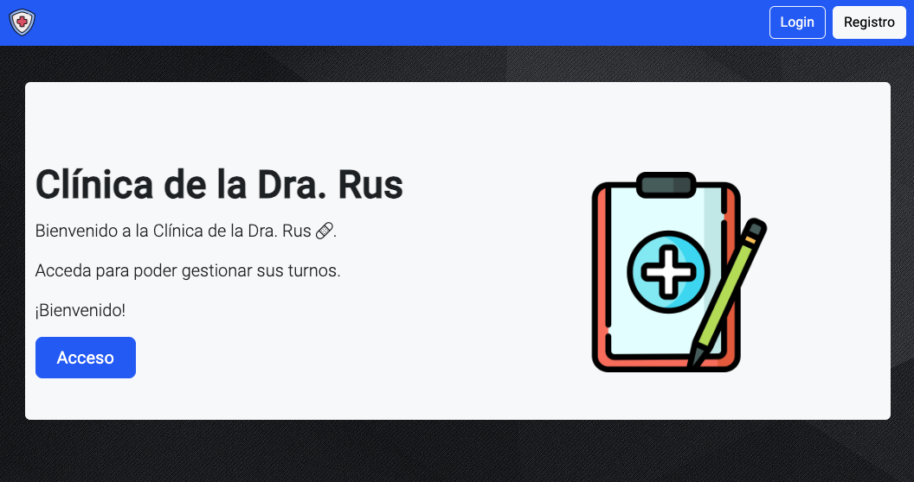

# Clínica de la Dra. Rus

TP final de la materia Laboratorio 4 de la Tenicatura Universitaria en Programación de la UTN-FRA.

Esta es la Clínica de la Dra. Rus. Puedes acceder como Administrador, Especialista o Paciente.

Link: https://clinicadrarus.web.app/home

La web está dividad en diferentes partes.

## Home
Pantalla principal.

## Login
Para loguearte.

## Registro
Para registrarte como paciente o como especialista.

## Mi perfil
Para ver tus datos.

### Paciente 
(con funciones de historial y reportes de turnos)

### Especialista
(puede declarar sus horarios)

## Sacar turno
(para administradores y pacientes)
Para sacar turnos.

## Mis turnos
Para buscar entre los turnos propios.

## Pacientes
(para especialistas)
Para ver el listado de pacientes propios.

## Usuarios
(para administradores)
Para ver un listado completo de usuarios. 

## Informes
(para administradores)
Para ver distintos informes estadísticos sobre la clínica.

